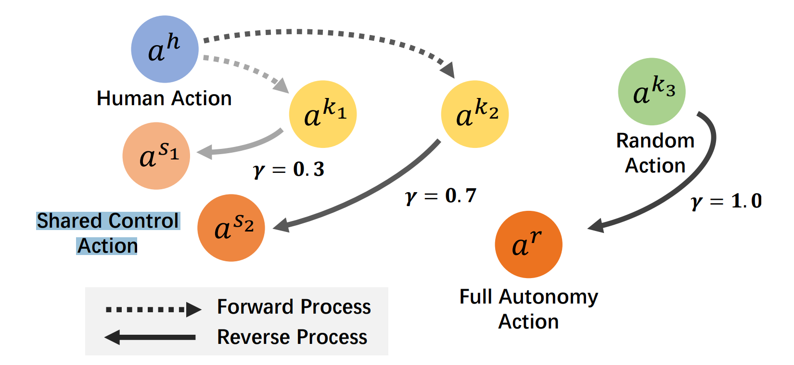

# HAJI Reading Notes

[Arxiv](https://arxiv.org/abs/2407.00299)

## Backgrounds

- Classic Paradigm Challenges:
  1. **Persistent Error** significantly degrade the teleoperation
  2. **Discrepancies** between the structures of human hands and robot end-effectors
  3. **The Lack of Haptic Feedback** during contact-rich manipulation (Haptic: 触觉)
- So, need human efforts and high-quality datasets.

## Intro

*In data-collection, how to make human effort less while improving the data quality?*

**HAJI**:
  1. Preferentially capture `intentions`.
  2. Agent to ensure `motion stability` and `interpolate`? the details.
  3. Shared control(with a growing ratio).


Acchived a 30% increase in data collection success rate and double the `collection speed`.

    My question about this part: how to define and measure the collection speed?

## Method

### In Brief

**Stage1**: Human control as an initial but insufficient training dataset.

**Stage2**: Train a diffusion-model-based assistive agent, establish shared control.

Growing with more data coming in and if sufficient able to full auto.

    How diffusion be used to control a robot? What the outputs of this model be like?

    Answer(from below parts): generate the action for agents

### A. Preliminary

**DDPM**
1. **Forward**: Adding Guassian noise to $x^0$ according to $\beta_{1:K}$ by $x_k = \sqrt{\alpha_k}x_{k-1} + \sqrt{1-\alpha_k}\varepsilon$, $\varepsilon \sim \mathcal{N}(\textbf{0, I})$, $\alpha_k = 1 - \beta_k$
2. **Reverse Process**: $p_\theta(x^0)=\int p(x^K)\prod p_\theta(x^{k-1}|x^k)dx^{1:k}$, where $p_\theta(x^{k-1}|x^k)=\mathcal{N}(\mu_\theta(x^k, k), \sum(x^k, k))$.
3. **Loss Func**: $\mathcal{L}:=\mathbb{E}\_{k,x_0,\varepsilon\sim\mathcal{N}(\textbf{0,I})}[||\varepsilon-\varepsilon_\theta(x_k(x_0,\varepsilon),k)||^2_2]$.
4. **Generate $x_0$**: $x_{k-1}=\mu_\theta(x_k, k) + \sigma_k z$, $z \sim \mathcal{N}(\textbf{0,I})$ (sampled recursively).
5. With collected trajaectory $\{(s_i,a_i)\}^T_{i=0}$, $\mathcal{L}:=\mathbb{E}\_{k,(s_i,a_i),\varepsilon\sim\mathcal{N}(\textbf{0,I})}[||\varepsilon-\varepsilon_\theta(a_i+\varepsilon,s_i,k)||^2_2]$.

```
Q: What is x_k(x_0,\varepsilon)?
A: A function to get x_k from x_0 with \varepsilon?
```

### B. Teleoperation System


We can get the human collected demonstration $\{(s_i,a_i)\}^T_{i=0}$, $s \in \mathbb{R}^n$ is the robot state.

```
Q: What state exactly?
```

### C. Diffusion-Model-Based Assistive Agent

**Agent**: $a=f(a^k|s,k)$.

During **Data Collection**, $a^s=\gamma a^h + (1-\gamma)a^r$, where $a^r$ is generated by agent $a^h$ is human action, and $a^s$ is `Shared Control Action`.



**Diffussion**: forward $a^k=a^h+\varepsilon^k$, backward $a^s=f(a^k|s,k)$

Increase $\gamma$ as $k$ grow. When $\gamma = 1.0$ $a^s$ turn to $a^r$, full robot auto action.

```
A little bit confused about H and D.
```

### D. Integrating Data Collection and Manipulation Learning

```
Q: May I see the code?
```

## Experiments

### A. Tasks

6

```
Q: What is in D? Is there only one movement for a perticular task? i.e. did we trained 6 agent? Or just one for all the tasks.
```

### B. Efficiency of Data Collection

"collect as much data as possible within three minutes"

```
Q: Is this definition rigorous enough?
```

**Evaluate**:
  1. **Success Rate**: How to tell?
  2. **Horizon Length**: Steps per Sample.
  3. **Collection Speed**: Samples per Hour.

### C. Quantitative Evaluation

For about half of my reading time, I was continuesly wondering about the meaning of training such a model as we can make the robot finish the task with our training data only. From Fig.4, I finally realized that the control process is in real time which means, after training, the human operator could be abstract, and robot will act base on the abstract instructions. This would save much time.
`Is this understanding right?`


But here comes another question, in III-B, we have $a^s=\gamma a^h + (1-\gamma)a^r$.

```
Q1: Is this a simple weighted mean of h and r? If so, is this weighted average the average on the motion path coordinates? Intuitively imagine, does this seem unrealistic? Or is this just an abstract expression?

Q2(If 6 tasks are trained together): When \gamma=1, what will it do? Is there an input of environment(which I didn't find)?

Q3(If 6 tasks are not trained together): What will happen if trained together?
```

E. Real World Experiment

## Appendix

### I. IMPLEMENTATION DETAILS

#### C. Diffusion-Model-Based Assistive Agent

```
MLP + Diffusion, How are they connected?
```

### II. EXPERIMENT SETUPS

#### C. Real World Experiment

Our input has changed from the original hand states and object states to the position and orientation of the robot arm end effector, as well as images from the first-person and third-person perspectives.

```
I didn't find where to input these things.
```