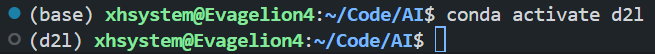
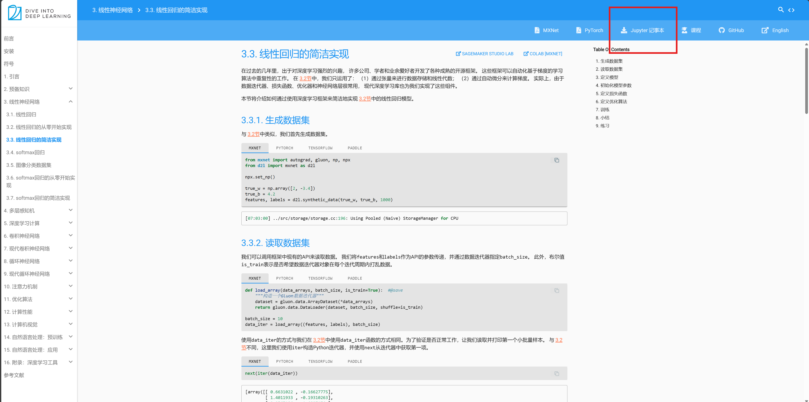

# 环境配置

[我们需要配置一个环境来运行 Python、Jupyter Notebook、相关库以及运行本书所需的代码，以快速入门并获得动手学习经验。](https://zh.d2l.ai/chapter_installation/index.html#:~:text=%E6%88%91%E4%BB%AC%E9%9C%80%E8%A6%81%E9%85%8D%E7%BD%AE%E4%B8%80%E4%B8%AA%E7%8E%AF%E5%A2%83%E6%9D%A5%E8%BF%90%E8%A1%8C%20Python%E3%80%81Jupyter%20Notebook%E3%80%81%E7%9B%B8%E5%85%B3%E5%BA%93%E4%BB%A5%E5%8F%8A%E8%BF%90%E8%A1%8C%E6%9C%AC%E4%B9%A6%E6%89%80%E9%9C%80%E7%9A%84%E4%BB%A3%E7%A0%81%EF%BC%8C%E4%BB%A5%E5%BF%AB%E9%80%9F%E5%85%A5%E9%97%A8%E5%B9%B6%E8%8E%B7%E5%BE%97%E5%8A%A8%E6%89%8B%E5%AD%A6%E4%B9%A0%E7%BB%8F%E9%AA%8C%E3%80%82)

以下流程建立在我们第一节上机课安装的`wsl2(ubantu)`环境下

## 确定python版本

在Ubuntu系统中查看Python版本，你可以使用以下命令：

打开终端。
输入以下命令之一：
查看系统默认Python版本：

```
python --version
```

或者

```
python -V
```
如果系统中安装了多个Python版本，你可以使用python3来查看Python 3.x的版本：

```
python3 --version
```
或者

```
python3 -V
```

## 安装Miniconda

下载链接:
[miniconda](https://docs.anaconda.com/miniconda/)

如果我们使用Linux，假设Python版本是3.9，将下载名称包含字符串“Linux”的bash脚本，并执行以下操作：

建议直接下载latest版本即可

```
# 文件名可能会更改
sh Miniconda3-py39_4.12.0-Linux-x86_64.sh -b
# 若下载的latest版本
sh Miniconda3-latest-Linux-x86_64.sh -b
```
接下来，初始化终端Shell，以便我们可以直接运行conda。

```
~/miniconda3/bin/conda init
```
现在关闭并重新打开当前的shell。并使用下面的命令创建一个新的环境：
```
conda create --name d2l python=3.9 -y
```
现在激活 d2l 环境：
```
conda activate d2l
```

PS:

助教尝试的时候使用的指令(仅供参考)
```
python3 --version
# 下载的文件为 Miniconda3-latest-Linux-x86_64.sh
sh Miniconda3-latest-Linux-x86_64.sh -b
~/miniconda3/bin/conda init
# 现在关闭并重新打开当前的shell。并使用下面的命令创建一个新的环境
conda create --name d2l python=3.10 -y
conda activate d2l
```

现在你可以看到你的终端大概如下:



出现了`(base)`, 并在执行`conda activate d2l`后出现`(d2l)`

## 安装深度学习框架和d2l软件包

请先确定你的计算机是否装有NVIDIA GPU

安装(or 确认是否安装)CUDA
```
nvcc --version
```
若未安装
```
# 可能要占用比较大的空间
sudo apt install nvidia-cuda-toolkit
```

安装MXNet的GPU版本，首先需要知道已安装的CUDA版本。假设已安装CUDA 11.5版本，请执行以下命令：
```
pip install mxnet-cu115
```
可以根据CUDA版本更改如上mxnet-cu101的最后一位数字， 例如：CUDA 10.0是cu100， CUDA 9.0是cu90。

如果太慢了建议使用交大的镜像
```
pip install -i https://mirror.sjtu.edu.cn/pypi/web/simple mxnet-cu115
```

如果机器没有NVIDIA GPU或CUDA，可以按如下方式MXNet的CPU版本：
```
pip install mxnet==1.7.0.post1
```

安装d2l包

```
pip install d2l
```

## 安装pytorch

在以下网站获取适合版本torch的安装指令

[pytorch](https://pytorch.org/get-started/locally/)

助教使用的

```
pip3 install torch torchvision torchaudio --index-url https://download.pytorch.org/whl/cu115
```

## 若要退出环境

```
conda deactivate
```
下次再使用时，请再执行
```
conda activate d2l
```

## 获取示例代码

在[动手学习深度学习](https://zh.d2l.ai)网站下载jupyter文件压缩包

如图所示



将其解压到你认为合适的工作目录

## 启动jupyter

```
jupyter notebook
```

会打开一个网页地址是[localhost:8888](http://localhost:8888/)

如图所示，会要求你输入token


token 在命令行中找到


会显示一个网址 token=...... token为`=`号后面的内容

将token复制到网页

你就能看到当前目录

然后选择某一个`.ipynb`文件打开，就能看到类似如下界面


点击`run/三角形图标`即可按照示例顺序运行代码

若要关闭 在命令行`ctrl+c`再按提示输入`y`即可

其中 部分代码存在前置依赖，即书本靠前章节创建了一些函数等，后面的章节直接使用了，若未运行过之前章节则会遇到错误

故需要按照书本顺序将前置的代码运行一遍

## 推荐内容：

后面注有文件路径的为可在`jupyter`运行的内容, 未标注的为推荐阅读内容

- [线性神经网络](https://zh.d2l.ai/chapter_linear-networks/linear-regression.html)
  - [线性回归的简洁实现](https://zh.d2l.ai/chapter_linear-networks/linear-regression-concise.html)(对应路径pytorch/chapter_linear-networks/linear-regression-concise.ipynb)
  - [softmax回归](https://zh.d2l.ai/chapter_linear-networks/softmax-regression-scratch.html) (运行`softmax-regression-concise`需要先运行过`softmax-regression-scratch`)
- [多层感知机](https://zh.d2l.ai/chapter_multilayer-perceptrons/mlp.html)
  - [多层感知机的从零开始实现](https://zh.d2l.ai/chapter_multilayer-perceptrons/mlp-scratch.html)(对应路径为pytorch/chapter_multilayer-perceptrons/mlp-scratch.ipynb)
  - [模型选择、欠拟合和过拟合](https://zh.d2l.ai/chapter_multilayer-perceptrons/underfit-overfit.html)
  - [前向传播、反向传播和计算图](https://zh.d2l.ai/chapter_multilayer-perceptrons/backprop.html)
- [LeNet数字识别](https://zh.d2l.ai/chapter_convolutional-neural-networks/lenet.html#id2)(对应路径pytorch/chapter_convolutional-neural-networks/lenet.ipynb)